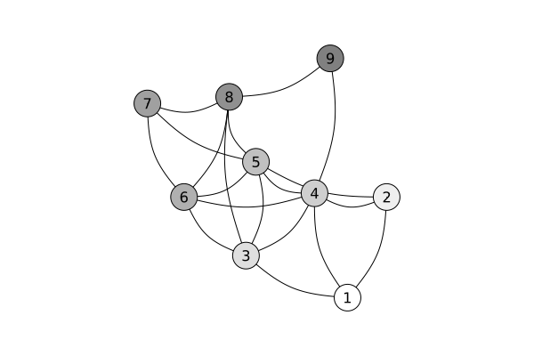

# GNN in 16 lines

As has been mentioned in [Mandlik2020](@cite), multiple instance learning is an essential piece for implementing message passing inference over graphs, the main concept behind spatial *Graph Neural Networks* (GNNs). It is straightforward and quick to achieve this with [`Mill.jl`](https://github.com/CTUAvastLab/Mill.jl). We begin with some dependencies:

```@example gnn
using Mill, Flux, Graphs, Statistics
```

Let's assume a graph `g`, represented as a `SimpleGraph` from [`Graphs.jl`](https://github.com/JuliaGraphs/Graphs.jl)

```@repl gnn
g = SimpleGraph(10)
for e in [(1, 2), (1, 3), (1, 4),
          (2, 4), (2, 5),
          (3, 4), (3, 5), (3, 6), (3, 8), (3, 10),
          (4, 5), (4, 6), (4, 9),
          (5, 7), (5, 8),
          (6, 5), (6, 7), (6, 8),
          (7, 8), (7, 10),
          (8, 9)
]
    add_edge!(g, e...)
end
```



Furthermore, let's assume that each vertex is described by three features stored in a matrix `X`:

```@repl gnn
X = ArrayNode(randn(Float32, 3, 10))
```

We use [`ScatteredBags`](@ref) from `Mill` to encode neighbors of each vertex. In other words, each vertex is described by a bag of its neighbors. This information is conveniently stored in `fadjlist` field of `g`, therefore the bags can be constructed as:

```@repl gnn
b = ScatteredBags(g.fadjlist)
```

Finally, we create two models. First model called `lift` will pre-process the description of vertices to some latent space for message passing, and the second one will realize the message passing itself, which we will call `mp`:

```@repl gnn
lift = reflectinmodel(X, d -> Dense(d, 4), SegmentedMean)
U = lift(X)
mp = reflectinmodel(BagNode(U, b), d -> Dense(d, 3), SegmentedMean)
```

Notice that `BagNode(U, b)` now essentially encodes vertex features as well as the adjacency matrix. This also means that one step of message passing algorithm can be realized as:

```@repl gnn
Y = mp(BagNode(U, b))
```

and it is differentiable, which can be verified by executing:

```@repl gnn
gradient(m -> sum(sin.(m(BagNode(U, b)))), mp)
```

If we put everything together, the GNN implementation is implemented in the following 16 lines:

```@example gnn
struct GNN{L, M, R}
    lift::L
    mp::M
    m::R
end

Flux.@functor GNN

function mpstep(m::GNN, U, bags, n)
    n == 0 && return(U)
    mpstep(m, m.mp(BagNode(U, bags)), bags, n - 1)
end

function (m::GNN)(g, X, n)
    U = m.lift(X)
    bags = Mill.ScatteredBags(g.fadjlist)
    o = mpstep(m, U, bags, n)
    m.m(vcat(mean(o, dims = 2), maximum(o, dims = 2)))
end

nothing # hide
```

As it is the case with whole `Mill`, even this graph neural network is properly integrated with [`Flux.jl`](https://fluxml.ai) ecosystem and suports automatic differentiation:

```@example gnn
zd = 4
f(d) = Chain(Dense(d, zd, relu), Dense(zd, zd))
agg = SegmentedMeanMax
gnn = GNN(reflectinmodel(X, f, agg),
          BagModel(f(zd), agg(zd), f(2zd)),
          f(2zd))
nothing # hide
```

```@repl gnn
gnn(g, X, 5)
gradient(m -> m(g, X, 5) |> sum, gnn)
```

The above implementation is surprisingly general, as it supports an arbitrarily rich description of vertices. For simplicity, we used only vectors in `X`, however, any `Mill` hierarchy is applicable.

To put different weights on edges, one can use [Weighted aggregation](@ref).
