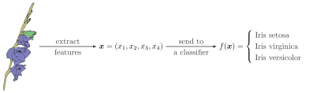

# Mill.jl
 Mill.jl is a library build on top of `Flux.jl` aimed to flexibly prototype *hierarchical multi-instance learning* models as described in [Pevny2018a](@cite) and  [Pevny2018b](@cite)

## What is Multiple instance learning (MIL) problem?

Why should I care about MIL problems?
Since the seminal paper of Ronald Fisher, the majority of machine learning problems deals with a problem shown below, 

```@raw html

```

where the input sample ``x`` is a vector (or more generally a tensor) of a fixed dimension, alteranativelly a sequence. 

The consequence is that if we want to use a more elaborate description of iris above, for example we wish to describe each of its leaf, blossoms, and stem, we will have a hard time, because every flower has different number of them. This means that to use the usual "fix dimension" paradigm, we have to either use features from a single blossom and single leaf, or aggregate descriptions of their sets, such that the output has a fixed dimension. This is clearly undesirable. We wish a framework that can flexibly and automatically and seamlessly deals with these sets, sets of sets, and cartesian product. 


In **Multiple instance learning** the sample ``x`` is a set of vectors (or matrices) ``\{x_1,\ldots,x_l\}`` with ``x_i \in R^d``, which means that order does not matter, and which is also the feature making MIL problems different from sequences. The multi-instance problems have been introduced in by Tom Diettrich in [Dietterich1997](@cite) in 1997, and extended and generalized in a series of works [Pevny2018a](@cite), [Pevny2018b](@cite), [Pevny2019](@cite). The most comprehensive introduction known to authors is [Mandlik2020](@cite)

The **Hierarchical Multiple instance learning** would approach the problem of iris classification as outlined below.

```@raw html

```

It will describe each leaf by a vector implying that all leaves are described by a set of vectors. The same will be done for blossoms (the set will be different of course). Note that such description allows each flower to have a different numbers of each entity. Finally, there will be a single vector describing a stem, since there is only one.

How does the MIL copes with variability in number of flowers and leafs (in MIL parlance they are called instances and their set is called a bag)? For each MIL problem, there are two feed-forward neural networks with element-wise aggregation operator like `mean` (or `maximum`) sandwiched between them. Denoting those feed-forward networks (FFN) by  ``f_1``  and ``f_2``, the output of a bag calculated is calculated as ``f_2 \left\(\frac{1}{l}\sum_{i=1}^l f_1(x_i) \right\)``, where we have used `mean` as an aggregation function. In [Pevny2019](@cite), authors have further extended the universal approximation theorem to MIL problems, their Cartesian products, and nested  MIL problems, i.e. a case where instances of one bag are in fact bags. 

This means that the flower in the above Iris example would be described by one bag describing leafs, another bag describing blossoms, and a vector describing stem. The HMIL model would have two FFNs to convert set of leafs to a single vector, another set of two FFNs to convert set of blossoms to a single vector. These two outputs would be concatenated with a description of a stem, which would be fed to yet another FFN providing the final classifications. And since whole scheme is differentiable, we can use standard SGD to optimize all FFNs together using only labels on the level of output.

The Mill library simplifies implementation of machine learning problems with (H)MIL representation. In theory, it can represent any problem that can be written represented in JSONs. That is why we have created a separate tool, JsonGrinder, which helps to Mill your JSONs.


## Relation to Graph Neural Networks
HMIL problems can be seen as a special subset of general graphs. They differ in two important ways
* In general graphs, vertices are of a small number of semantic type, whereas in HMIL problems, the number of semantic types of vertices is much higher (it is helpful to think about HMIL problems as about those for which JSON is a natural representation).
* The computational graph of HMIL is a **tree**, which implies that there exist an efficient inference. Contrary, in general graphs (with loops) there is no efficient inference and one has to resort to message passing (Loopy belief propagation).
* One update message in **loopy belief propagation** can be viewed as a MIL problem, as it has to produce a vector based on infomation inthe neighborhood, which can contain arbitrary number of vertices.

## Difference to sequences
The major difference is that sequence does not matter. This means that if a sequence $$(a,b,c)$$ should be treated as a set, then the output of a function `f` should be the same for any permutation, i.e. $$f(abc) = f(cba) = f(bac) =\ldots$$. This property has a dramatic consequence of the computational complexity. Sequences are typically modeled using Recurrent Neural Networks (RNN), where the output is calculated as $$f(abc) = g(a, g(b, g(c)))$$ (with a slight abuse of a notation). During optimization, a gradient of $$g$$ needs to be calculated recursively, giving raise to infamous vanishing / expanding gradient. In constrast, in MIL calculates the output as $$ f(\frac{1}{3}(g(a) + g(b) + g(c)))$$ (slightly abusing notation again), which means that the gradient of $$g$$ is calculated in parallel and not recurrently. 

A more detailed overview of this subject can be found in [Mandlik2020](@cite).


## References

```@bibliography
```
